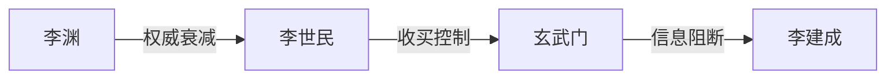

# <div align="center"> 🪞 铜镜 · 历史决策智能体</div>
> **华夏五千年智慧 × Palantir方法论 × AI赋能**

## 🚀 项目使命
**让李世民在玄武门前的抉择，成为你今天决策的沙盒**  
通过本体论建模将《资治通鉴》转化为可计算的决策引擎，为现代治理提供历史智能系统

## 今日首发：玄武门之变本体库


## 🛠️ 五分钟上手
```python
# 安装本体分析工具包
pip install bronze-mirror

# 推演权力继承风险
from bronzemirror import XuanwuGate
print(XuanwuGate.coup_risk(power_ratio=1.7, team_loss=0.65))
# 输出：{"risk_level": "CRITICAL", "advice": "检查关键节点控制者"}
```

## 👥 加入共创
| 角色           | 技能要求                 | 入门任务                     |
|----------------|------------------------|----------------------------|
| 历史标注员     | 熟悉中国历史            | 标注《资治通鉴·唐纪》争议事件 |
| Python开发者   | 熟悉Neo4j              | 构建事件链自动抽取工具        |

> 🌍 **路线图**：玄武门MVP → 资治通鉴全本 → 全球多语言扩展  
> **行动派**：前10位Star本仓用户将永久列入「铜镜开光者」名录！
